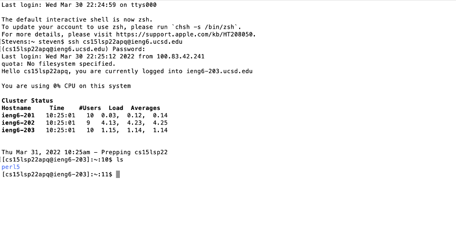
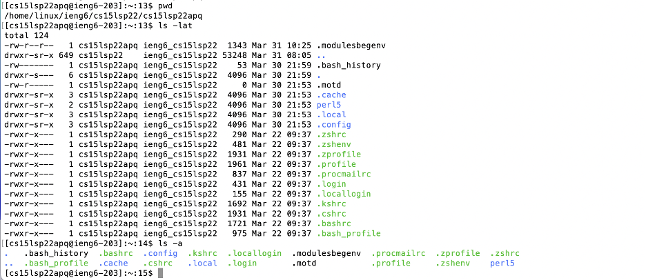
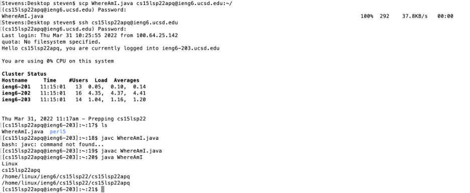

# CSE15LSP22 Lab Report 1
*By Qingyu Zhu*

## Tutorial on Remote Server Log-in:

---
* First Step - Installing VScode: 
Go to [VScode Download](https://code.visualstudio.com/Download#) website to download and install the Visual Studio Code on your computer. This is an IDE where you can write code and run commands in its terminal, which is needed for doing remote control. You will see a screen as below once you've installed and opened VScode on your computer. (Make sure to download the version that best fits your computer!)

* Second Step - Remotely Connecting:
Open the terminal in VScode (You may also use the one that's originally on your computer). Enter `ssh cs15lwi22username@ieng6.ucsd.edu` on your command line, where *username* should be the one you're assigned with. After this, enter your own password and then you will connect successfully! (As below)

* Third Step - Try Some Commands!:
Try running more commands on the terminal: `cd`, `ls`, `pwd`, `mkdir`, `ls -a`, `ls -lat`...; These are all *Linux Commands* and you can find more on the Internet. Below are some examples of running these commands:

* Fourth Step - Moving Files with `scp`:
Create a java file on your computer. Then type in the terminal `scp filename.java cs15lsp22username@ieng6.ucsd.edu:~/`, where filename is the file name of the java file you've created and the username is your user name as previous. Log in again to the server using `ssh` and run command `ls`, the file would appear in the home directory. Run `javac` and `java` on the server:

* Fifth Step - Setting an SSH Key:

