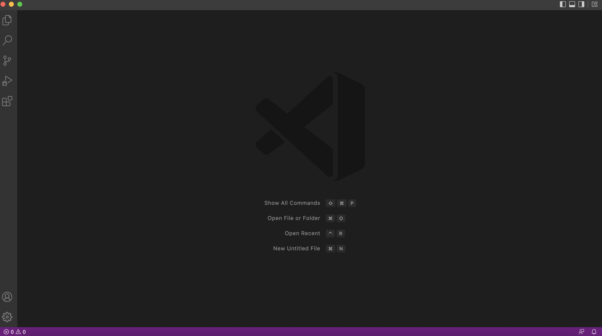

# CSE15LSP22 Lab Report 1
*By Qingyu Zhu*

## Tutorial on Remote Server Log-in:

---
* First Step: 
Go to [VScode Download](https://code.visualstudio.com/Download#) website to download and install the Visual Studio Code on your computer. This is a IDE where you can write code and run commands in its terminal, which is needed for doing remote 

