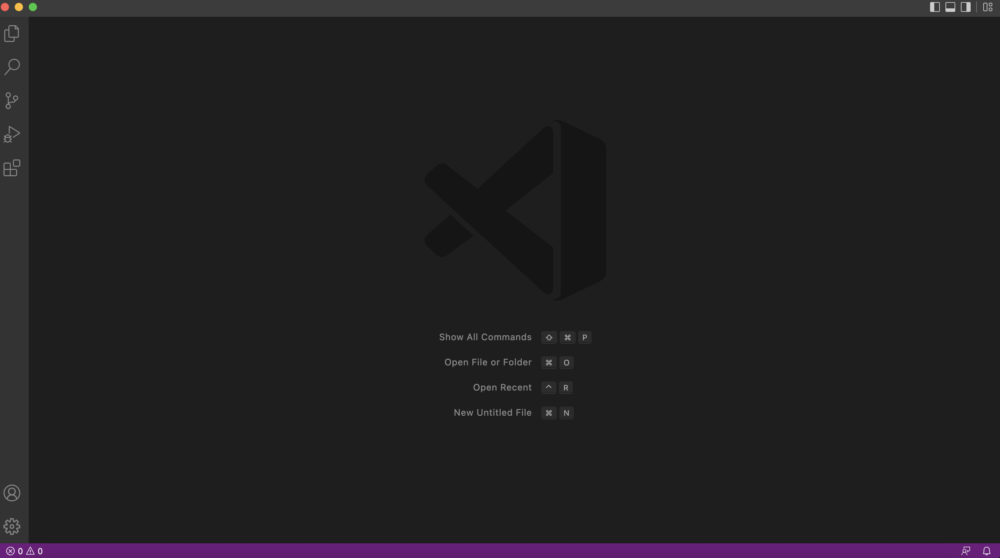
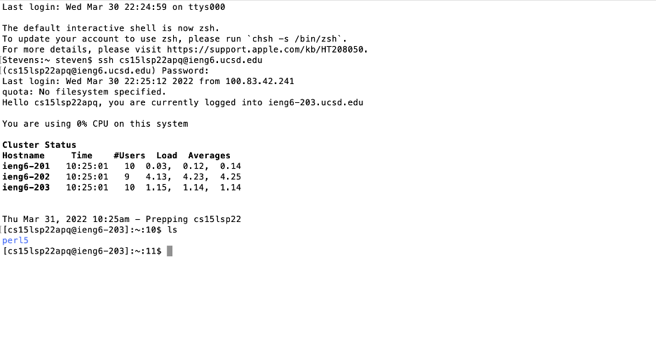
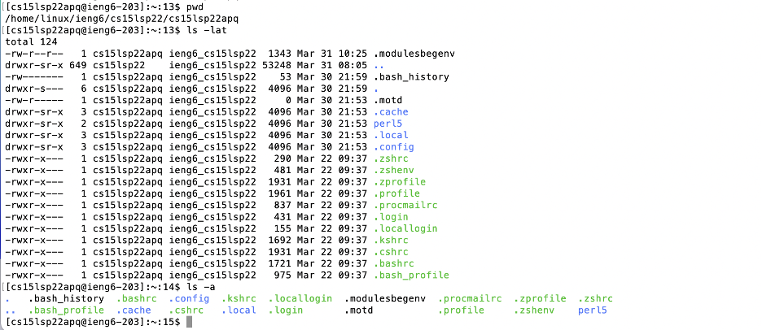
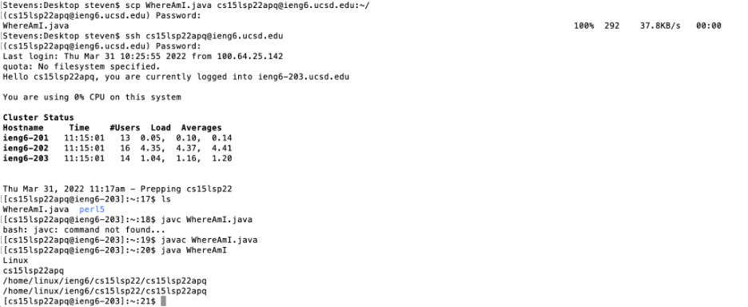
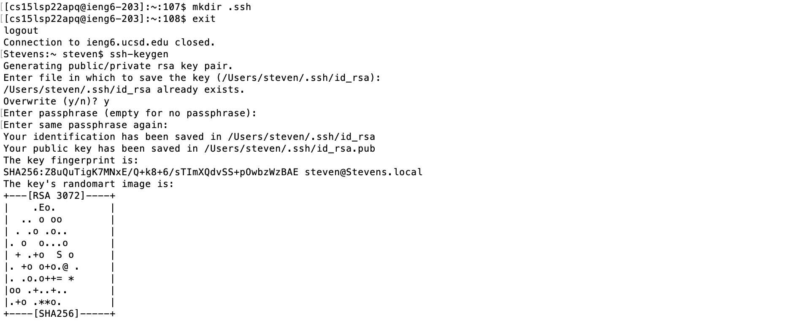
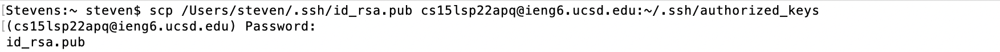
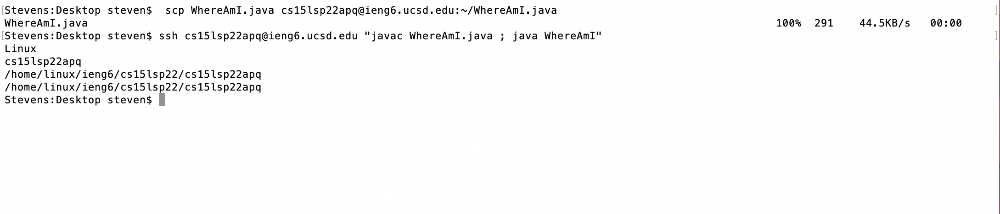

# CSE15LSP22 Lab Report 1
*By Qingyu Zhu*

## **Tutorial on Remote Server Log-in:**

---
## First Step - Installing VScode: 
* Go to [VScode Download](https://code.visualstudio.com/Download#) website to download and install the Visual Studio Code on your computer. -- *This is an IDE where you can write code and run commands in its terminal, which is needed for doing remote control.*  

* You will see a screen as below once you've installed and opened VScode on your computer. (Make sure to download the version that best fits your computer!)

## Second Step - Remotely Connecting:
* Open the terminal in VScode (You may also use the one that's originally on your computer).

* Enter `ssh cs15lwi22username@ieng6.ucsd.edu` on your command line, where *username* should be the one you're assigned with. 

* After this, enter your own password and then you will connect successfully! (As below)

## Third Step - Try Some Commands!:
* Try running more commands on the terminal: `cd`, `ls`, `pwd`, `mkdir`, `ls -a`, `ls -lat`...; -- *These are all **Linux Commands** and you can find more on the Internet.*

* Below are some examples of running these commands:

## Fourth Step - Moving Files with `scp`:
* Create a java file on your computer. Then type in the terminal `scp filename.java cs15lsp22username@ieng6.ucsd.edu:~/`, where *filename* is the file name of the java file you've created and *username* is your user name as previous.  

* Log in again to the server using `ssh` and run command `ls`, the file would appear in the home directory. Run `javac` and `java` on the server:

## Fifth Step - Setting an SSH Key:
* On your computer, run command `ssh-keygen`, and when prompted to add a paraphrase, leave it empty, then a private key and a public key are created.

* Log in to the server and create a `.ssh` directory with `mkdir .ssh`. 

* Copy the public key from your computer to `.ssh` on the server using `scp /Users/<user-name>/.ssh/id_rsa.pub cs15lsp22username@ieng6.ucsd.edu:~/.ssh/authorized_keys`, where *user-name* is the name of your computer and *username* is as previous.

* Once these are done, you can now log in to the server from your computer without entering your password.

## Sixth Step - Optimizing Remote Running:
* (1) Write a command in quotes at the end of a `ssh` command will run this command directly on the server;

  (2) Add semicolons between commands would let you run multiple commands on one line.

* Then we can run `scp WhereAmI.java cs15lsp22apq@ieng6.ucsd.edu:~/WhereAmI.java` and then `ssh cs15lsp22apq@ieng6.ucsd.edu "javac WhereAmI.java ; java WhereAmI"`, which are more convenient.

---