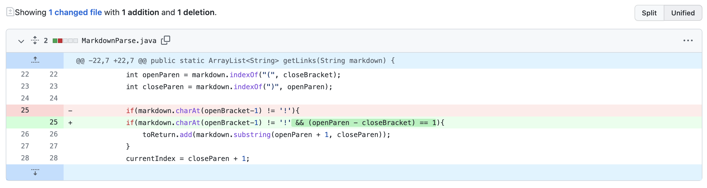

# CSE15LSP22 Lab Report 2
*By Qingyu Zhu*

## **Debugging Process for MarkdownParse**

---
## Modification #1:

**Detailed code changes:**

[**Test File**](https://github.com/StevenZhuqy/markdown-parser/blob/main/test-file8.md) that induces a failure to the code.

**Symptom:** causing an infinite loop

**Underlying logistics:**
* In our code, it's assumed that a pair of brackets and a pair of parentheses form a set, and they appear in the input file in complete sets so that we can easily search and locate them to extract links in between. Such assumptions potentially lead to bugs in code.

* However, this particular input file contains incomplete bracket-parenthesis set, and the program will search again and again in the loop for those missing parts, eventually entering an infinite loop, which is the symptom for this bug.

* Fixing it, we can use a `if` statement to check if there are complete sets after the point of searching, and stop the loop if there isn't.

## Modification #2:

**Detailed code changes:**

[**Test File**](https://github.com/StevenZhuqy/markdown-parser/blob/main/test-file6.md) that induces a failure to the code.

**Symptom:** returning a photo reference instead of a website link

**Underlying logistics:**
* The potential bug in our code is that it cannot distinguish between an image and a link in *Markdown* language. It can only extract things between two parentheses。

* The failure-inducing input file contains only an image and no link. Our code, ideally, should've returned an empty list with no link, yet the photo reference is returned, which is the symptom for this bug.

* Fixing it, we can use a `if` statement to determine whether a bracket-parenthesis set represents a link or an image by searching for "!".

## Modification #3:

**Detailed code changes:**

[**Test File**](https://github.com/StevenZhuqy/markdown-parser/blob/main/test-file5.md) that induces a failure to the code.

**Symptom:** returning something that is not essentially a link in *Markdown*

**Underlying logistics:**
* Again, the potential bug in our code is that it doesn't take into consideration the spaces between bracket-parenthesis pairs, as, in *Markdown*, links can only be validly represented with bracket-parenthesis pairs that are closely connected in right order.

* The input file has texts in brackets and parentheses that're not actually links since there're many spaces in between. However, contents, not links, between the parentheses are returned, which is the symptom for this bug.

* Fixing it, we can add another condition into our `if` statement to include only the cases where bracket-parenthesis pairs are closely connected, namely those valid links.

---
