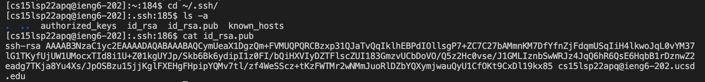
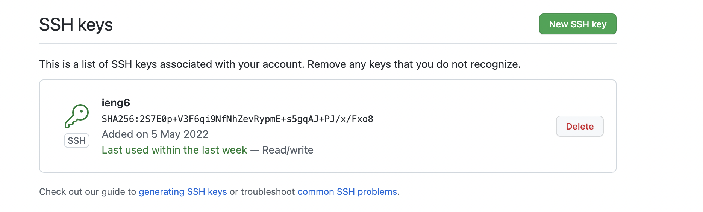
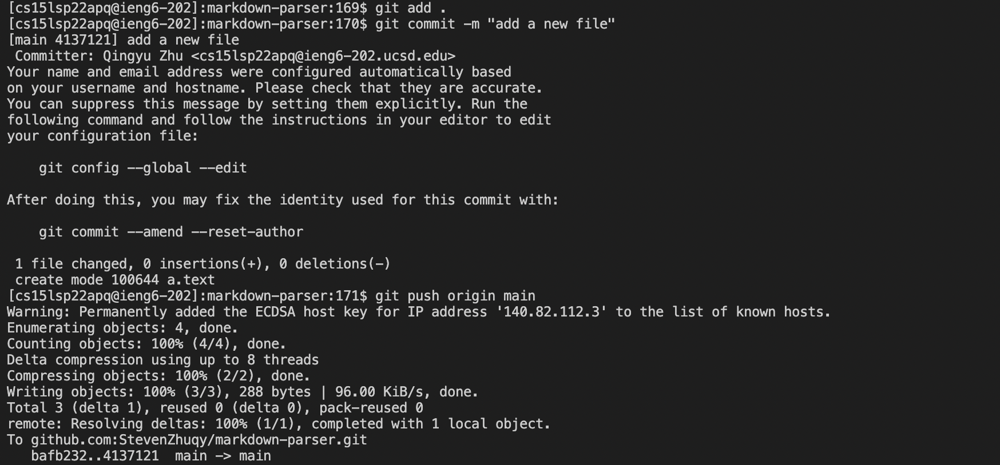
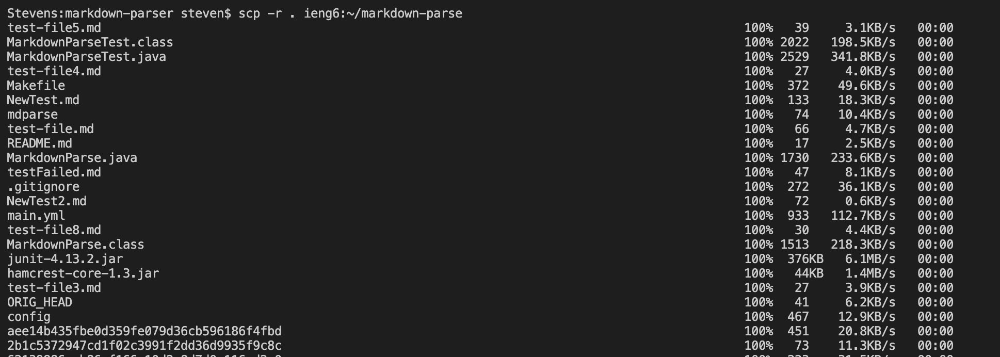
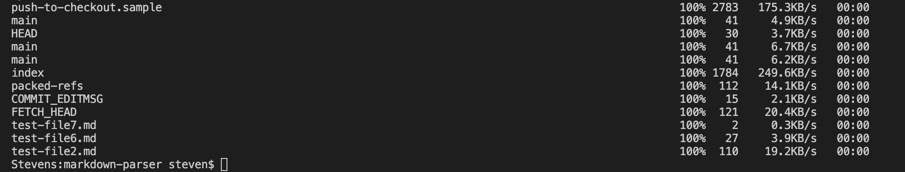
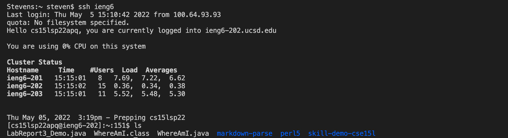
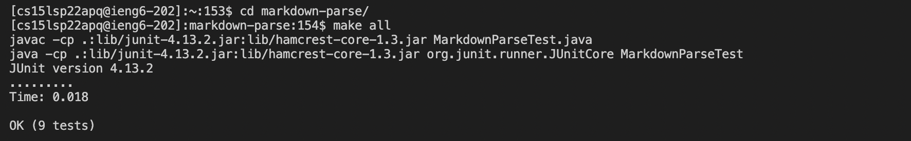
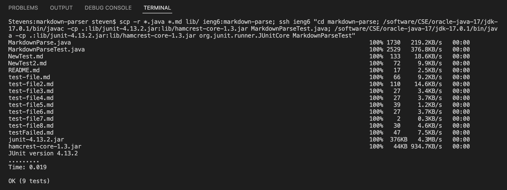

# CSE15LSP22 Lab Report 3
*By Qingyu Zhu*

## **Group Operation Options for Lab5**

---
## Streamlining ssh Configuration:

***.ssh/config file using VScode:***

***ssh login:***

***scp command:***

***Description:***
* In order to save some typing during ssh-logins, we can take advantage by creating a configuration file that specifies a username when logging into a server.

* In this config file, we can add information regarding our unique username on the specific server.

* With the configuration file ready, we can now run commands such as `ssh` and `scp` that connect with the remote server using only the short alias (*name* after `Host`) that we've chosen.

## Setup Github Access from ieng6:

***public key:***

***private key:***

***commit and push on ieng6:***

[This is the link](https://github.com/StevenZhuqy/markdown-parser/commit/4137121fa8e4414d1e240cdd2ab3f51375d0e726) for the resulting commit.

***Description:***
* In order to make, commit, and push changes to our Github repository from a remote server like ieng6, we need to setup a key pair between the server and Github.

* After creating a public ssh key on ieng6 server using `ssh-keygen`, we should copy this key to Github so that a private key can be as well created on Github.

* With the key-connection being set up, we can now commit and push our changes from the server to Github directly.

## Copy whole directories with `scp -r`:

***copying the whole directory:***

...

***logging in, compiling, and running tests:***

***integrating operations in one line:***

***Description:***
* The command `scp -r` provides us with a convenient way to copy a whole directory (including all the files and directories within it) to the remote server.

* By using notations such as `;` and `" "`, we can further simplify our steps as they enable us to run multiple operations, including copying, compiling, and testing, in one single line.

---
