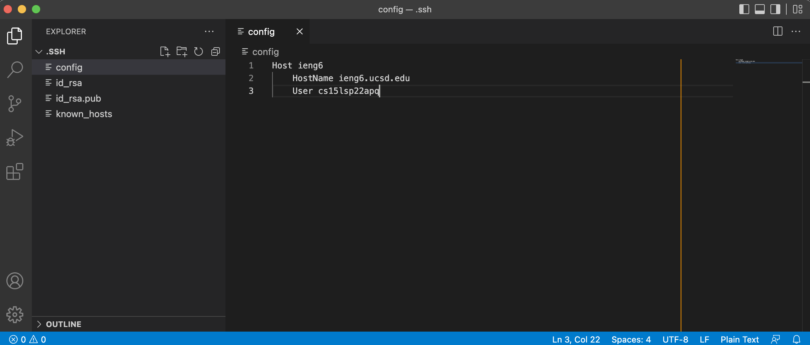
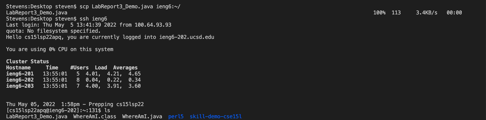

# CSE15LSP22 Lab Report 3
*By Qingyu Zhu*

## **Group Operation Options for Lab5**

---
## Streamlining ssh Configuration:

***.ssh/config file using VScode:***

***ssh login:***

***scp command:***

***Description:***
* In order to save some typing during ssh-logins, we can take advantage by creating a configuration file that specifies a username when logging into a server.

* In this config file, we can add information regarding our unique username on the specific server.

* With the configuration file ready, we can now run commands such as `ssh` and `scp` that connect with the remote server using only the short alias (*name* after `Host`) that we've chosen.

## Setup Github Access from ieng6:

