# CSE15LSP22 Lab Report 4
*By Qingyu Zhu*

## **MarkdownParse Implementations Review**

---
**Repositories for Review:**

[This is the link](https://github.com/StevenZhuqy/markdown-parser) to my markdown-parse repository

[This is the link](https://github.com/Miyuki-L/markdown-parser) to the markdown-parse repository that I reviewed

---

## For Snippet #1:

***Expected Output:*** [`google.com, google.com, ucsd.edu]
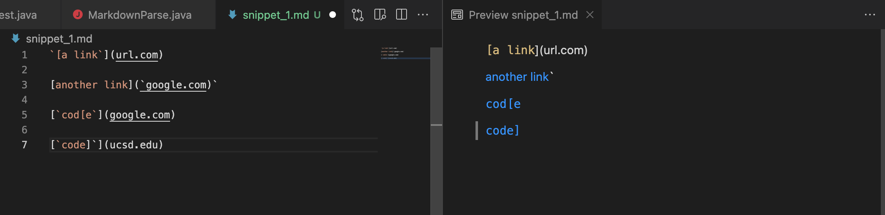
*(Preview from VScode)*

***JUnit Test for Snippet#1:***
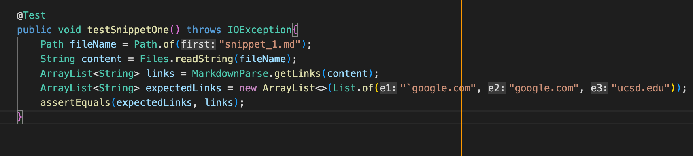

***Test Output for My Implementation:*** Test Failed
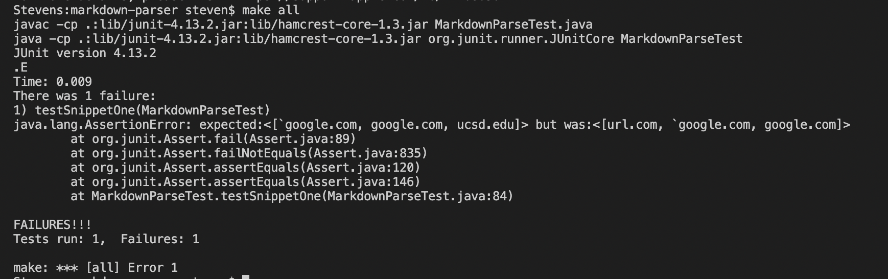

***Test Output for the Other Implementation:*** Test Failed
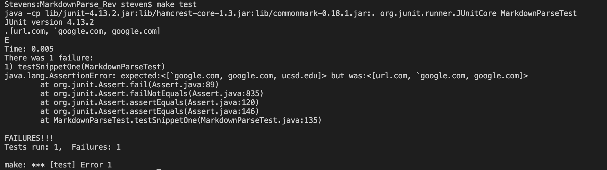

***Answer to Question regarding Snippet#1:***
* Yes, I think the program can function properly for snippet 1 and its related cases with a small code change less than 10 lines.

* We need to check if there are backticks that proceed the open bracket or the open parenthesis. We would also have to check if there are open/close barkets and open/close parentheses that exist inside a pair of backticks, which are considered to be
integrated parts of the code style in Markdown.

* These can be achieved by adding two if-statements to the program, each checking one of the situations above. They should ignore those invalid link formats and not add them to the list to be returned.

## For Snippet #2:

***Expected Output:*** [a.com, a.com(()), example.com]
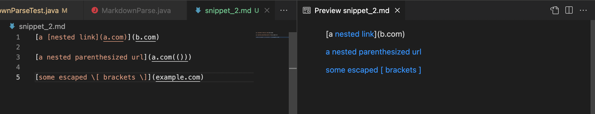
*(Preview from VScode)*

***JUnit Test for Snippet#2:***
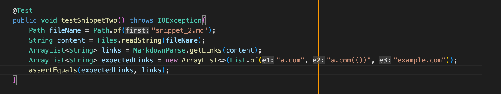

***Test Output for My Implementation:*** Test Failed
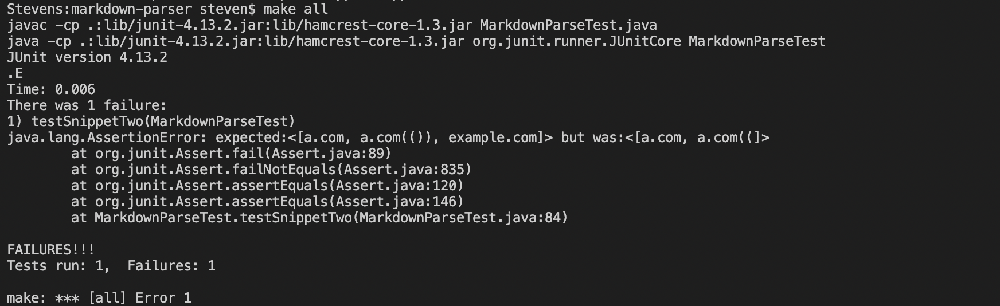

***Test Output for the Other Implementation:*** Test Failed
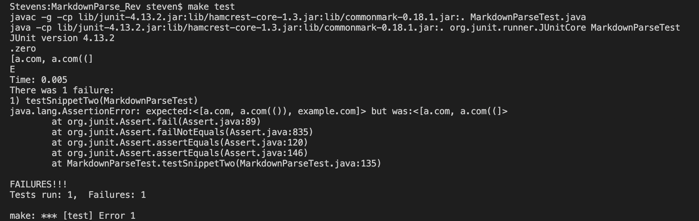

***Answer to Question regarding Snippet#2:***
* No, I don't think a small code change will make the program work for snippet 2 and its related cases, and a more involved change is needed.

* My program is designed initially for handling cases with perfect pairs of brackets and parentheses while ignoring those that don't form complete pairs. Nested parentheses/brackets and escaped brackets would completely mess up the indexing in my program, leading to error outputs.

* To throughly fix the problem, a complete change to the underlying structure of my program may be needed. Otherwise, a series of long if-statements need to be added to cover all the edge cases, resulting in a code change much longer than 10 lines.

## For Snippet #3:

***Expected Output:*** [https://sites.google.com/eng.ucsd.edu/cse-15l-spring-2022/schedule]
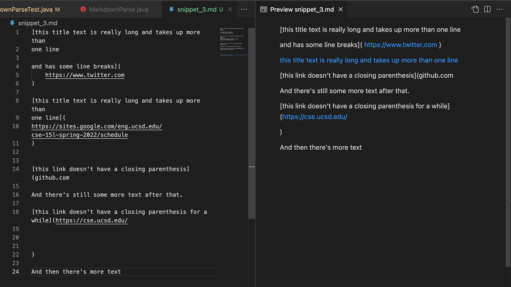
*(Preview from VScode)*

***JUnit Test for Snippet#3:***
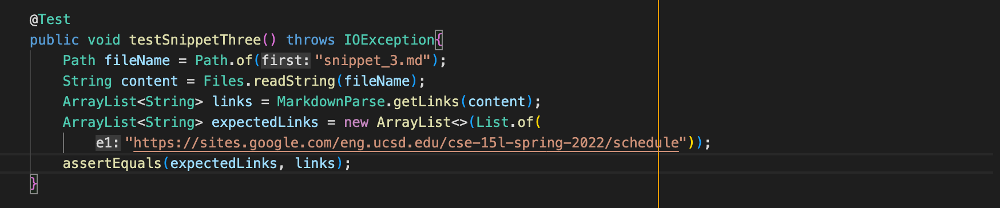

***Test Output for My Implementation:*** Test Failed
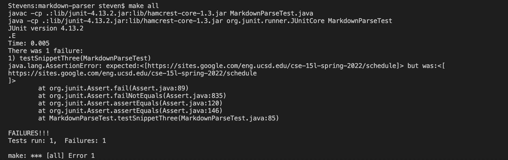

***Test Output for the Other Implementation:*** Test Failed
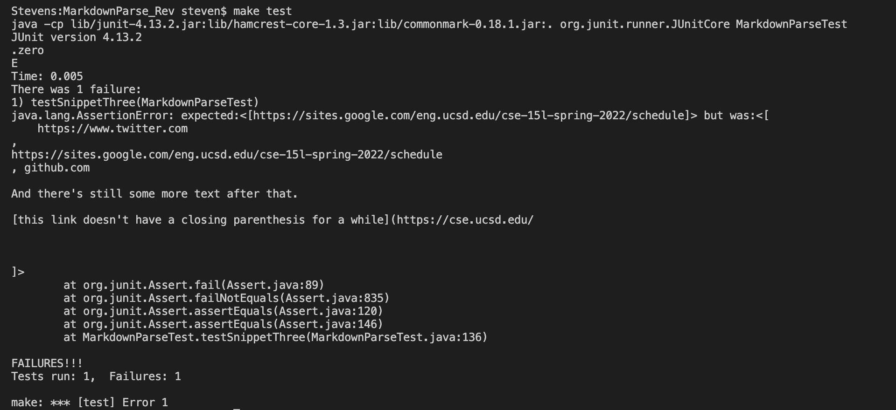

***Answer to Question regarding Snippet#3:***
* Yes, a small code change would make my program work for cases like snippet 3, as my program's output is already pretty close to the expected output.

* My program is already able to handle cases that have spaces between parentheses, and now it only need to check situations of newlines in brackets and parentheses.

* Two if-statements can be added to my program to examine cases of single newline and multiple newlines, helping the program to skip through the cases of multiple `\n` and add only those valid links to the list to be returned *(Single newline, which is valid link format, should be discarded when adding to list)*.

---
