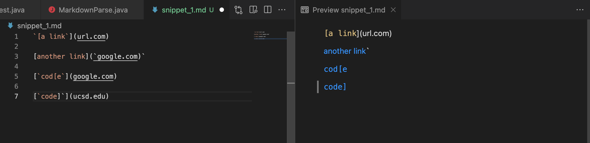

# CSE15LSP22 Lab Report 4
*By Qingyu Zhu*

## **MarkdownParse Implementations Review**

---
**Repositories for Review:**

[This is the link](https://github.com/StevenZhuqy/markdown-parser) to my markdown-parse repository

[This is the link](https://github.com/Miyuki-L/markdown-parser) to the markdown-parse repository that I reviewed

## For Snippet #1:

***Expected Output:*** [`google.com, google.com, ucsd.edu]

