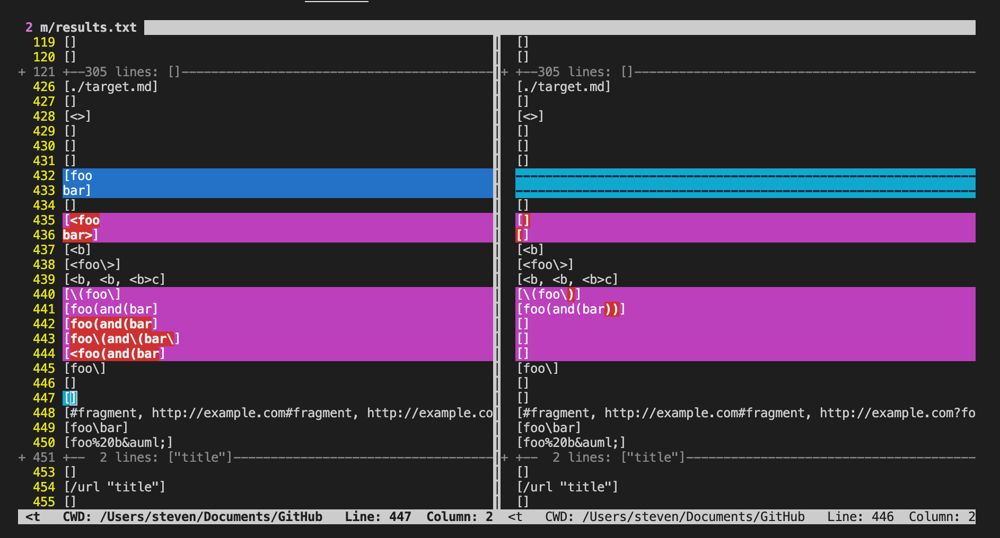
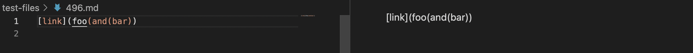
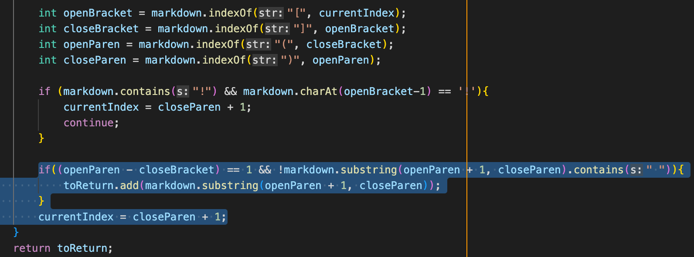

# CSE15LSP22 Lab Report 5
*By Qingyu Zhu*

## **More on MarkdownParse**

---
## Identifying tests with different results:

***Using `vimdiff` to show the tests that give different results:***

***Links to the test-file with different results:***

[This is the link](https://github.com/nidhidhamnani/markdown-parser/blob/main/test-files/496.md) for the first test-file 

[This is the link](https://github.com/nidhidhamnani/markdown-parser/blob/main/test-files/574.md) for the second test-file

---

## For Test-file #1:

***Expected Output:*** []

***Actual Outputs:*** (Above: mine; Below: provided)

* For this test-file, the provided implementation is correct as it produces the expected output. However, my own implementation gives a wrong output.

* My own implementation is wrong as it's not capable of identifying and handling nested or escaped parentheses and brackets, and it can only capture and return whatever is between a pair of parentheses.

* More if-statements with more rigorous conditions that check for nested or escaped parentheses should be added before adding a valid link to the returned list (as screenshot below).

## For Test-file #2:

